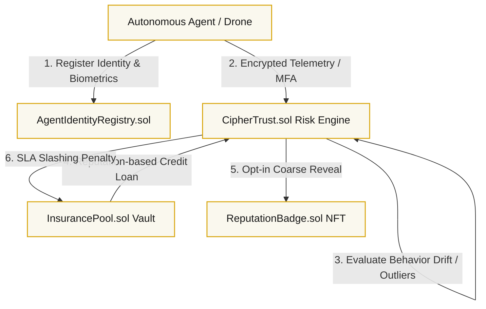

# 🛡️ CipherTrust: Confidential Underwriting for Autonomous Agents & Robots

CipherTrust is a decentralized **Confidential Risk Underwriting, Authentication, and Parameter Pricing Engine** designed specifically for the autonomous machine economy (AI trading bots, drone fleets, DePIN nodes, and delivery robots). 

By leveraging **Fully Homomorphic Encryption (FHE)** via secure `fhEVM` pipelines, CipherTrust monitors encrypted telemetry and evaluates risk profiles entirely under encryption. The protocol allows third-party smart contracts (e.g. marketplaces, lending platforms, or DAOs) to verify that an autonomous agent is authenticated, unique, sufficiently bonded, and operating safely without ever exposing raw logs, coordinates, biometrics, or proprietary trade secrets.

---

## 🎨 System Design & Architecture



---

## 🔬 Core FHE Capabilities & Mathematical Innovations

### 1. FHE-Passport (Biometric Uniqueness & Sybil Rejections)
To prevent Sybil attacks by cloning agent IDs, CipherTrust implements biometric passport checks under FHE. It computes the Manhattan distance between a new template $(X, Y, Z)$ and registered database templates $(D_X, D_Y, D_Z)$ entirely in ciphertext:
$$\text{dist} = |X - D_X| + |Y - D_Y| + |Z - D_Z|$$
If the distance to any registered template falls below the uniqueness threshold ($\text{dist} \le 10$), the registration fails on-chain.

### 2. FHE-Aegis (AI Behavioral Drift & Rogue Slashing)
CipherTrust detects compromised or hijacked AI agents by comparing real-time telemetry $(O_T, O_F, O_C)$ against their baseline configuration $(B_T, B_F, B_C)$. Aegis calculates the squared Euclidean distance under FHE:
$$\text{drift} = (O_T - B_T)^2 + (O_F - B_F)^2 + (O_C - B_C)^2$$
If the drift exceeds the allowed safety margin, a KMS callback automatically deactivates the agent and slashes their staked bond directly into the `InsurancePool`.

### 3. FHE-Stream (Confidential Salary & Yield Streaming)
Allows organizations to stream payroll or staking yields to agents with encrypted flow rates per block. The accrued stream yield is calculated under encryption:
$$\text{accrued} = \text{flowRate} \cdot \Delta B$$
Decrypted tokens are safely dispatched via secure KMS callbacks directly to the agent's wallet.

### 4. FHE-Triangulation (Confidential Physical Location Verification)
Ingests encrypted distance squared values ($d_A^2, d_B^2, d_C^2$) from 3 anchor beacons and validates coordinates $(X, Y)$ under FHE:
$$\text{calcDistSq}_i = (X - X_i)^2 + (Y - Y_i)^2$$
$$\text{error}_i = |\text{calcDistSq}_i - d_i^2|$$
$$\text{totalError} = \text{error}_A + \text{error}_B + \text{error}_C \le 100$$
Allows DePIN and robot fleets to verify geographic boundaries without revealing coordinate coordinates.

### 5. Encrypted Bayesian Filter (EBF)
Monitors real-time operational reliability. The core trust score mean ($\mu_t$) is kept encrypted as an FHE handle, while the estimation uncertainty variance ($\sigma^2_t$) is tracked publicly:
$$\sigma^2_{t+1} = \frac{\sigma^2_t \cdot \sigma^2_{obs}}{\sigma^2_t + \sigma^2_{obs}}, \quad \alpha = \frac{\sigma^2_{obs}}{\sigma^2_t + \sigma^2_{obs}}, \quad \beta = \frac{\sigma^2_t}{\sigma^2_t + \sigma^2_{obs}}$$
$$\mu_{t+1} = \alpha \cdot \mu_t + \beta \cdot x_{obs}$$
As uncertainty decays, the required collateral bond reduces dynamically.

### 6. FHE-Shield (Anti-Spam Filter) & FHE-Pass (Challenge-Response MFA)
*   **FHE-Shield:** Filters agent inbox communications using an on-chain encrypted Bayesian categorizer.
*   **FHE-Pass:** Standard passwordless challenge-response verification entirely under FHE.

---

## 🛠️ Repository Structure

*   `contracts/CipherTrust.sol`: Core FHE risk pricing engine, Bayesian scoring, Aegis drift detectors, and FHE-Stream yield processors.
*   `contracts/InsurancePool.sol`: ERC-4626 capital vault funded by slashed rogue agent bonds.
*   `contracts/ReputationBadge.sol`: Soulbound ERC-721 badge showing revealed trust tiers.
*   `contracts/AgentIdentityRegistry.sol`: ERC-8004 portable identity and passport mapping.
*   `test/CipherTrust.test.ts`: Complete unit test suite (20 passing tests covering all FHE edge cases).
*   `frontend/`: Premium Next.js application built with warm cream aesthetics and Framer Motion glassmorphism.

---

## 💻 Quickstart

### 1. Hardhat Setup & Test Execution
Install dependencies:
```bash
npm install
```

Compile the smart contracts:
```bash
npx hardhat compile
```

Run the complete test suite (includes 19 FHE unit tests and simulator scenarios):
```bash
npx hardhat test
```

### 2. Run Interactive DApp Dashboard Locally
Navigate to the frontend folder, install dependencies, and start the development server:
```bash
cd frontend
npm install
npm run dev
```
Open [http://localhost:3000](http://localhost:3000) to access the landing page and control panel.

---

## 📄 License
MIT
